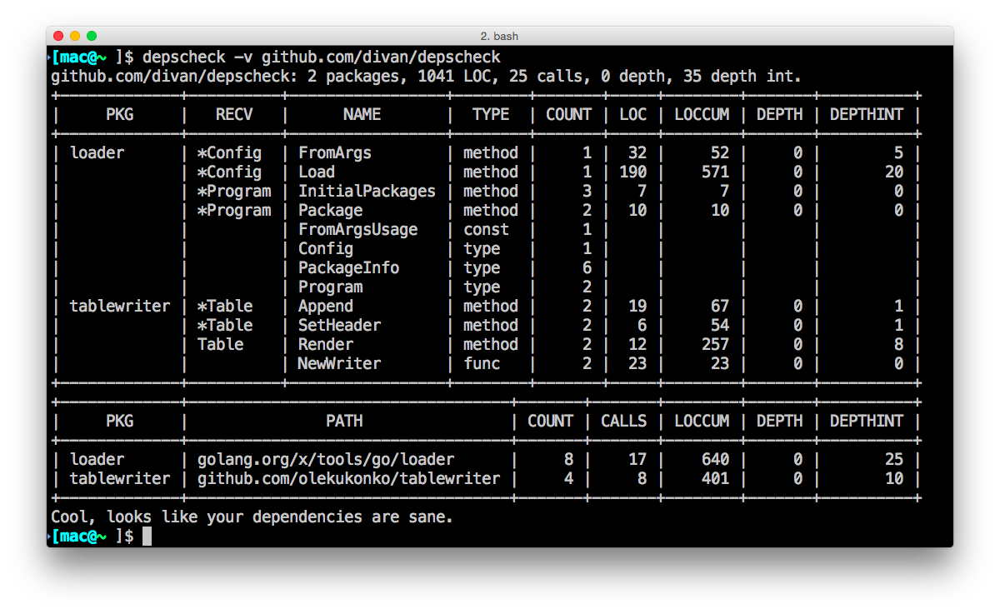

# DepsCheck

[](https://travis-ci.org/divan/depscheck)
[](https://goreportcard.com/report/github.com/divan/depscheck)
[](https://github.com/divan/depscheck/releases)
[](https://github.com/divan/depscheck/releases)

Dependency checker for Golang (Go) packages. Prints stats and suggests to remove small LeftPad-like imports if any.

## Introduction

DepsCheck analyzes source code of your package and all its imports and attempts to find good candidates to be removed as a dependency. It only suggests to pay attention to those dependencies, nothing more.
It also can shows detailed statistics for imported packages usage, including external functions, methods, variables and types used in your project. For functions and methods it calculates LOC (Lines Of Code), Cumulative LOC (sum of nested functions), number of calls, nesting depth and so on.



This tool was inspired by famous [LeftPad incident](http://blog.npmjs.org/post/141577284765/kik-left-pad-and-npm) in NPM/Javascript community. Although Go community do not tend to create packages for every single function over there, the goal is to let programs guide us and help people to learn better practices.

Also some inspiration came from one of the [Go Proverbs](http://go-proverbs.github.io):

> A little copying is better than a little dependency.

If you struggle to understand how it applies with DRY and why it's wise point, I suggest you to check out [this video](https://www.youtube.com/watch?v=PAAkCSZUG1c) on a subject.

## Installation

Just run go get:

```bash
    go get github.com/divan/depscheck
```

To update:

```bash
    go get -u github.com/divan/depscheck
```

## Usage

The usage is straightforward - just pass the package path (*github.com/user/package*) you want to check. Path can be also the dot (.) - in this case depscheck will check package in current directory. Also, you may pass one or many *.go files:

    depscheck .
    depscheck github.com/divan/expvarmon
    depscheck main.go
    depscheck /tmp/test.go /tmp/test.go

In default mode, *depscheck* only prints totals stats and suggestions for small dependencies.
The `-v` flag will print more verbose info with detailed statistics:

    depscheck -v .
    depscheck -v github.com/Typeform/goblitline

By default, only external packages are checked. Use `-internal` flag in case you want to see statistics on internal and vendored packages too.

    depscheck -v -internal golang.org/x/tools/go/loader

With `-stdlib` flag, *depscheck* also can analyze stdlib packages and treat them as an external dependencies. Suggestion mode is disabled with stdlib flag (stdlib is smarter than this tool), so you will probably will want `-v` flag to see how your package uses stdlib.

    depscheck -stdlib -v net/http
    depscheck -stdlib -v github.com/divan/gofresh

Sometimes you want only totals statistics - how many packages, calls and LOC in total used by your package. Use `-totalonly` flag to get single-line easily parseable output with totals. You can even run *depscheck* agains every stdlib package in a loop:

    depscheck -totalonly -stdlib encoding/json
    for i in $(go list std); do depscheck -stdlib -totalonly $i; done
    
Don't forget `-help` flag for detailed usage information.

## Sample Output

```bash
$ depscheck -v github.com/divan/expvarmon
github.com/divan/expvarmon: 4 packages, 1022 LOC, 93 calls, 11 depth, 23 depth int.
+--------+---------+---------------------+-----------+-------+-----+--------+-------+----------+
|  PKG   |  RECV   |        NAME         |   TYPE    | COUNT | LOC | LOCCUM | DEPTH | DEPTHINT |
+--------+---------+---------------------+-----------+-------+-----+--------+-------+----------+
| byten  |         | Size                | func      |     1 |  14 |     19 |     0 |        2 |
| jason  | *Object | GetInt64            | method    |     1 |  15 |     98 |     0 |        6 |
|        | *Object | GetStringArray      | method    |     1 |  28 |    128 |     0 |        6 |
|        | *Object | GetValue            | method    |     1 |   2 |     62 |     0 |        4 |
|        | *Value  | Array               | method    |     1 |  25 |     25 |     0 |        0 |
|        | *Value  | Boolean             | method    |     1 |  15 |     15 |     0 |        0 |
|        | *Value  | Float64             | method    |     2 |   8 |     23 |     0 |        1 |
|        | *Value  | Int64               | method    |     2 |   8 |     23 |     0 |        1 |
|        | *Value  | String              | method    |     1 |  15 |     15 |     0 |        0 |
|        |         | NewObjectFromReader | func      |     1 |   2 |     46 |     0 |        2 |
|        |         | Object              | type      |     2 |     |        |       |          |
|        |         | Value               | type      |     2 |     |        |       |          |
| ranges |         | Parse               | func      |     1 |  29 |     29 |     0 |        0 |
| termui |         | AttrBold            | const     |     6 |     |        |       |          |
|        |         | ColorBlue           | const     |     1 |     |        |       |          |
|        |         | ColorCyan           | const     |     4 |     |        |       |          |
|        |         | ColorGreen          | const     |     7 |     |        |       |          |
|        |         | ColorRed            | const     |     1 |     |        |       |          |
|        |         | ColorWhite          | const     |     4 |     |        |       |          |
|        |         | ColorYellow         | const     |     1 |     |        |       |          |
|        |         | EventKey            | const     |     1 |     |        |       |          |
|        |         | EventResize         | const     |     1 |     |        |       |          |
|        |         | Close               | func      |     2 |   2 |     30 |     1 |        0 |
|        |         | EventCh             | func      |     1 |   4 |      4 |     0 |        0 |
|        |         | Init                | func      |     2 |  11 |    109 |     1 |        0 |
|        |         | NewList             | func      |     2 |   6 |      6 |     0 |        0 |
|        |         | NewPar              | func      |     5 |   6 |      6 |     0 |        0 |
|        |         | NewSparkline        | func      |     2 |   5 |      5 |     0 |        0 |
|        |         | NewSparklines       | func      |     2 |   3 |      3 |     0 |        0 |
|        |         | Render              | func      |     2 |   9 |    129 |     5 |        1 |
|        |         | TermHeight          | func      |     2 |   4 |    120 |     2 |        0 |
|        |         | TermWidth           | func      |     2 |   4 |    120 |     2 |        0 |
|        |         | UseTheme            | func      |     2 |   7 |      7 |     0 |        0 |
|        |         | Bufferer            | interface |     2 |     |        |       |          |
|        |         | Attribute           | type      |     1 |     |        |       |          |
|        |         | List                | type      |     4 |     |        |       |          |
|        |         | Par                 | type      |    10 |     |        |       |          |
|        |         | Sparkline           | type      |     4 |     |        |       |          |
|        |         | Sparklines          | type      |     5 |     |        |       |          |
+--------+---------+---------------------+-----------+-------+-----+--------+-------+----------+
+--------+---------------------------------+-------+-------+--------+-------+----------+
|  PKG   |              PATH               | COUNT | CALLS | LOCCUM | DEPTH | DEPTHINT |
+--------+---------------------------------+-------+-------+--------+-------+----------+
| byten  | github.com/pyk/byten            |     1 |     1 |     19 |     0 |        2 |
| jason  | github.com/antonholmquist/jason |    11 |    15 |    435 |     0 |       20 |
| ranges | github.com/bsiegert/ranges      |     1 |     1 |     29 |     0 |        0 |
| termui | gopkg.in/gizak/termui.v1        |    26 |    76 |    539 |    11 |        1 |
+--------+---------------------------------+-------+-------+--------+-------+----------+
 - Package byten (github.com/pyk/byten) is a good candidate for removing from dependencies.
   Only 19 LOC used, in 1 calls, with 2 level of nesting
 - Package ranges (github.com/bsiegert/ranges) is a good candidate for removing from dependencies.
   Only 29 LOC used, in 1 calls, with 0 level of nesting
```

You can see that depscheck suggested to take a look into two packages - `byten` and `ranges`. It makes sense and I'm going to follow its advice. Those packages are really small and only one small function is used from both of them.

## Notes

- Suggestions made by this tool are totally optional and could be totally false alarms. The language used is "package X is a good candidate to be remove" to bring your attention to inspect this package and decide.
- Terms 'Depth' and 'DepthInternal' in statistics mean a number of external/internal dependencies (functions/methods/vars). Function with one level of external nested calls that contain 3 of them will have Depth equal 3. If 'depth' sounds strange, I'd be glad to hear suggestions on better naming. Also, actual func depth is easy to calculate.
- This tool is beta and may report incorrect info and contain bugs. Don't rely a lot on its results without double checking.
- There are many situations where it's really hard to even define what is "correct" - for example Cumulative Lines Of Code for code that has recursive dependencies. Also, external function with 1 line may use global variable or channel that is used by 99% other package's funcs. It's hard to predict all possible cases.
- If you're encountered a situation where tools is reporting incorrectly or panics - feel free to open an issue or (better) create Pull Request.
- This tool require Go 1.6+

## License

MIT License
